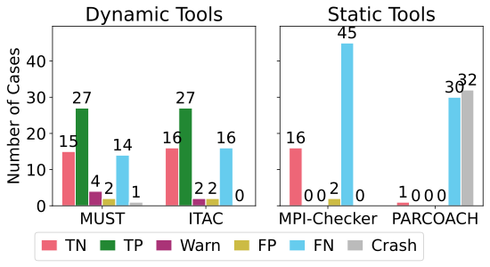

# MPI-CorrBench Dashboard

The MPI-CorrBench Dashboard lists the most up-to-date results for the [MPI-CorrBench](https://github.com/tudasc/mpi-corrbench) MPI correctness tools benchmark suite.
The results displayed are generated automatically from the CI pipeline of the main repository.

For version information for the different tools tested, please see at the bottom of this file.
For prior results, please check out this repositories history.

## Overall Results

## Results for Point to Point Communication

## Results for Collective Operations

## Results for User defined Types

## Results for One sided Communication

## Stats
* Visualization generated on Mon Jun 14 23:43:04 UTC 2021
* Using  [Corrbench](https://github.com/tudasc/mpi-corrbench "MPI-CorrBench") version [6b58704d](https://github.com/tudasc/mpi-corrbench/commit/6b58704d3c21ddc9426e158be5f51404abfb91e9)
* Must Version : 1.7.0
* ITAC Version : 2021.2.0-215
* Mpi-Checker (clang-tidy) version : 10.0
* PARCOACH Version : 6990ff4 (master)
