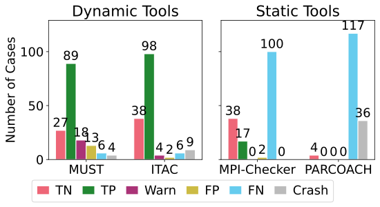
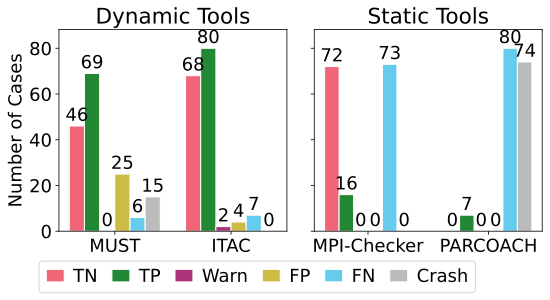
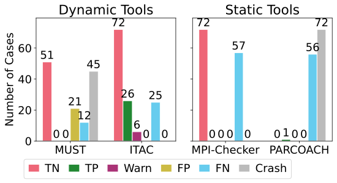

# mpi-corrbench-dashboard
The MPI-CorrBench dashboard shows and updates the tool results

## Overall Results

## Results for Point to Point Communication

## Results for Collective Operations

## Results for User defined Types

## Results for One sided Communication

## Stats
* Visualization generated on Sat May 22 00:07:32 UTC 2021
* Using  [Corrbench](https://github.com/tudasc/mpi-corrbench "MPI-CorrBench") version [9f2c5e35](https://github.com/tudasc/mpi-corrbench/commit/9f2c5e3539ffc5d5147fd26b03ab3395a5e4dc0e)
* Must Version : 1.7.0
* TTAC Version : (No Data for itac: No Licnse to execute it in CI container)
* Mpi-Checker (clang-tidy) version : 10.0
* PARCOACH Version : 6990ff4 (master)
