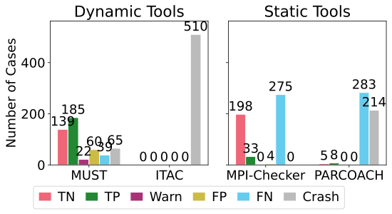
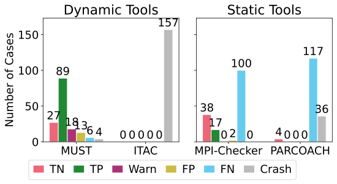
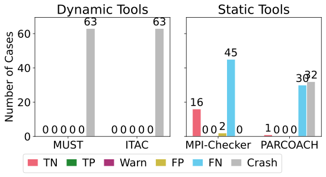
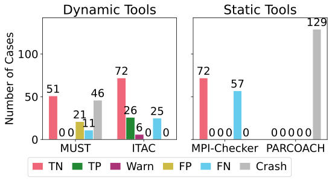

# mpi-corrbench-dashboard
The MPI-CorrBench dashboard shows and updates the tool results

## Overall Results

## Results for Point to Point Communication

## Results for Collective Operations

## Results for User defined Types

## Results for One sided Communication

## Stats
